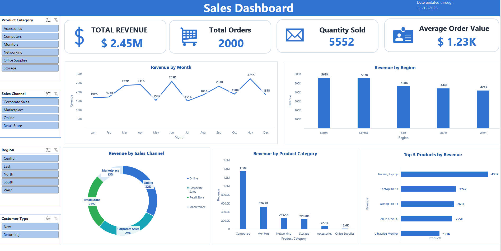

# Sales Performance & Revenue Optimization Analysis

**Tools:** Microsoft Excel · MySQL 8+ · Statistics  
**Domain:** Sales and Revenue Analytics  
**Project type:** Descriptive and diagnostic data analytics  
**Dataset:** Simulated portfolio dataset

> This project uses practice data created for portfolio analysis. The findings demonstrate an analytics workflow and should not be interpreted as results from a real company.



## 1. Business Problem

A business wants to understand where its revenue comes from and which products, regions, channels, customer types, and salespeople deserve further attention. A dashboard alone is not enough: decision-makers also need reliable calculations, evidence-backed findings, and clear next steps.

This project answers questions such as:

- Which months and regions contribute the most revenue?
- Which product categories and products are the strongest revenue contributors?
- Which sales channel generates the most revenue?
- How does average order revenue differ between new and returning customers?
- How is revenue distributed across orders and products?
- What patterns appear across discount levels, and what should be investigated further?

## 2. Dataset

The dataset contains **2,000 orders**, with one row representing one order, covering **January–December 2026**.

| Dataset characteristic | Detail |
|---|---:|
| Orders | 2,000 |
| Analytical columns | 12 |
| Regions | 5 |
| Sales channels | 4 |
| Customer types | 2 |
| Product categories | 6 |
| Products | 28 |
| Salespeople | 15 |

Fields include `Order_ID`, `Date`, `Region`, `Sales_Channel`, `Customer_Type`, `Product_Category`, `Product`, `Salesperson`, `Quantity`, `Unit_Price`, `Discount`, and `Revenue`.

Revenue is calculated as:

```text
Revenue = Quantity × Unit Price × (1 − Discount)
```

The project validates this derived measure before interpreting the sales results.

## 3. Tools and Methodology

### Excel

- Organized the order-level data in an Excel Table.
- Built PivotTables and supporting calculations for business questions.
- Created an interactive dashboard with KPI cards, charts, and slicers.
- Calculated descriptive statistics and used IQR-based outlier analysis.

### MySQL

- Checked row counts, unique order IDs, missing values, valid categories, and revenue calculations.
- Answered business questions using aggregations, subqueries, CTEs, `CASE WHEN`, ranking, and window functions.
- Used `RANK()` to compare products, `LAG()` for month-over-month analysis, and `NTILE()` to examine order-value segments.
- Reconciled the SQL KPI summary with the project reporting figures.

### Statistics

- Mean, median, standard deviation, quartiles, and interquartile range (IQR).
- Exploratory correlation and revenue-distribution analysis, interpreted cautiously because revenue is calculated from quantity, unit price, and discount.
- Outlier identification to find high-revenue orders that deserve closer review.

## 4. Key Results and Findings

The figures below describe this simulated portfolio dataset, not a real company's results.

- **Scale:** $2.45M revenue across 2,000 orders; average order revenue was $1,226.04, while the median was $406.55.
- **Main revenue drivers:** Computers contributed 54.9% of revenue, and Online generated about 10% more revenue than Corporate Sales.
- **Concentration:** Above-average orders made up 32.2% of orders but contributed 84.08% of revenue; the top 10% of orders contributed 45.14%.

| KPI / finding | Result |
|---|---:|
| Total revenue | **$2,452,084.30** |
| Orders analyzed | **2,000** |
| Quantity sold | **5,552** |
| Average revenue per order | **$1,226.04** |
| Highest-revenue month | **November — approximately $274.37K** |
| Computers share of total revenue | **54.9% (approximately $1.35M)** |
| Top five products' share of total revenue | **Approximately 57.7%** |
| Online vs Corporate Sales revenue | **$791.54K vs $718.75K; Online is about 10% higher** |
| North vs Central regional revenue | **$561.75K vs $556.71K; a near tie (under 1% apart)** |
| Returning vs new orders and average revenue per order | **Returning: 1,311 orders, ~$1,284 average and ~$477 median; New: 689 orders, ~$1,116 average and ~$305 median** |
| Highest-revenue salesperson | **Mei Tan — approximately $224.07K (9.14% of total revenue)** |
| Salespeople above average salesperson revenue | **8 of 15** |
| Discount-band comparison | **See the four-band breakdown below** |
| Above-average orders' share of total revenue | **32.2% of orders contribute approximately 84.08% of revenue** |
| Top 10% of orders' share of total revenue | **Approximately 45.14%** |
| High-revenue outliers by the IQR rule | **124 orders (6.20%)** |
| Exploratory correlation with revenue | **Quantity: approximately -0.0040; Unit Price: +0.7813; Discount: -0.0235** |

### What the results show

1. **Revenue is concentrated by category and product.** Computers and the leading products account for a substantial share of revenue, so their contribution and availability merit regular review.
2. **Channel performance differs while the North and Central regions are nearly tied.** Compare channel results by product category and customer type before making allocation decisions.
3. **Revenue is concentrated in higher-value orders.** Review the mean alongside the median to avoid treating a skewed average as the typical order value.
4. **Returning customer orders have higher observed order values than new customer orders.** This is a descriptive comparison and does not establish that tenure causes higher spend.
5. **Average order revenue does not rise steadily across discount bands.** Product mix and order composition may explain some or all of the differences, so the pattern does not establish a discount effect.
6. **Outliers should be reviewed rather than automatically removed.** An IQR flag identifies orders to investigate, not records that should be deleted automatically.

#### Discount-band comparison

| Discount band | Definition | Orders | Average order revenue |
|---|---|---:|---:|
| No discount | 0% | 282 | $1,005.71 |
| Low | 3%, 5% | 714 | $1,433.67 |
| Medium | 8%, 10% | 660 | $1,146.58 |
| High | 15%, 20% | 344 | $1,128.17 |

**Correlation note:** Because Revenue is calculated from Quantity, Unit Price, and Discount, correlations with Revenue are descriptive checks only and do not establish causation.

## 5. Dashboard

The `Sales_Dashboard` worksheet presents:

- Total Revenue, Total Orders, Quantity Sold, and Average Order Value.
- Revenue by month, region, sales channel, and product category.
- Top five products by revenue.
- Slicers for product category, sales channel, region, and customer type.

The other workbook sheets support reproducibility:

- `Sales_Data` — order-level records.
- `Supporting_pivots` — supporting PivotTables.
- `Business_Questions` — questions, answers, and analysis sources.
- `Statistical_Analysis` — descriptive statistics, correlations, and IQR analysis.

## 6. Business Recommendations

These are proposed actions for a hypothetical business, based on patterns in the simulated dataset.

- **Merchandising lead — monitor leading products weekly.** Track category and product revenue share alongside availability before making assortment decisions.
- **Sales channel lead — compare channels monthly.** Break down channel revenue and average order revenue by product category and customer type before changing campaign effort or budget.
- **Regional sales manager — investigate regional differences.** Compare the North and Central regions by category and channel to understand the small overall gap and document the main contributing combinations.
- **CRM/customer relationship lead — test a returning-customer initiative.** Run a defined pilot and compare average and median order revenue against a pre-pilot baseline; the dataset does not include customer IDs for measuring repeat-purchase rate.
- **Sales operations analyst — monitor order-value concentration.** Track average and median order revenue and the share contributed by high-value orders in each reporting cycle.
- **Promotions owner — evaluate all four discount bands before changing policy.** Compare product and customer mix within each band; the observed differences are not proof that a discount causes higher or lower revenue.
- **Data / sales operations owner — review IQR-flagged orders.** Classify each flagged order as valid or requiring correction and document the counts; do not delete orders solely because they fall outside the statistical fence.

## 7. Validation and Limitations

- The project includes row-count, duplicate-order, missing-value, category, and revenue-formula checks.
- Revenue is derived from quantity, unit price, and discount; correlations involving revenue need careful interpretation.
- The dataset is simulated/practice data and is not a messy production ETL dataset.
- No cost field is included, so profit or margin cannot be calculated.
- This is descriptive and diagnostic analysis, not forecasting or predictive modeling.
- Correlation and group differences do not establish causation.

## 8. Reproducibility

Use the repository files below to rerun the Excel and SQL analysis.

1. **Review the Excel source:** open `excel/Sales_Performance_Revenue_Optimization.xlsx` and inspect the `Sales_Data`, `Supporting_pivots`, `Sales_Dashboard`, `Business_Questions`, and `Statistical_Analysis` sheets.
2. **Import the SQL CSV:** load `data/Sales_Performance_CSV.csv` into MySQL 8+ and create or select the `sales_performance` database.
3. **Create and validate the table:** use `sql/Sales_Performance_Revenue_Optimization.sql` to create the `sales_data_performance` table, run the data-quality checks, and then run the analysis queries.
4. **Map CSV headers to SQL columns:** the CSV uses spaces in multi-word headers, while the SQL table uses underscores. Map `Order ID` → `Order_ID`, `Sales Channel` → `Sales_Channel`, `Customer Type` → `Customer_Type`, `Product Category` → `Product_Category`, and `Unit Price` → `Unit_Price`; single-word headers retain their names. Confirm the date, discount, and revenue types are imported correctly before running the checks.
5. **Reconcile the outputs:** compare row counts, revenue-formula checks, total revenue, order count, quantity, and average order revenue with the Excel workbook. Investigate differences rather than silently changing the documented source KPIs.

